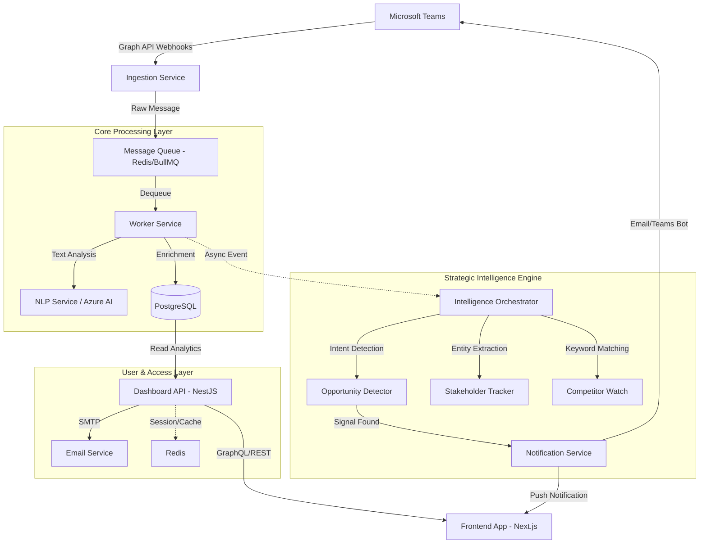

# System Design Document: MS Teams Insights Aggregator (v2.1)

## 1. High-Level Architecture
The system follows a micro-services architecture pattern, enhanced with a specialized **Strategic Intelligence Engine** to process unstructured chat data into actionable business insights, and a robust **Identity & Access Management (IAM)** module for secure user administration.

## 2. Component Design

### 2.1 Ingestion Service
- **Role**: High-throughput gateway for Microsoft Graph webhooks.
- **Functionality**:
    - Validates webhook signatures (HMAC).
    - Decrypts resource data (if encrypted).
    - Buffers raw messages into the Message Queue to handle traffic spikes without data loss.
    - Manages subscription renewal with MS Graph.

### 2.2 Core Worker Service
- **Role**: Standard message processing and sanitization.
- **Functionality**:
    - **Sanitization**: Removes HTML tags, personal identifiers (PII) where not required.
    - **Basic NLP**: Calls Azure Cognitive Services for Sentiment Analysis and Language Detection.
    - **Contextualization**: Maps `ChannelID` -> `ProjectID` / `ClientID` using cached mappings.
    - **Persistence**: Stores the cleaned message and basic metadata in PostgreSQL.

### 2.3 Strategic Intelligence Engine
- **Role**: Advanced analytics module for business intelligence.
- **Modules**:
    - **Opportunity Detector**: Uses LLM/NLP rules to identify "Buying Signals" (e.g., "budget", "new initiative", "RFP"). Classifies urgency (Hot/Warm).
    - **Competitor Watch**: Scans messages against a `CompetitorDictionary` (e.g., Accenture, CMC). Flag mentions with context (Positive/Negative).
    - **Stakeholder Tracker**: Uses Named Entity Recognition (NER) to detect job titles and names (e.g., "New CTO", "Mr. Tanaka"). Updates the `StakeholderMap`.
    - **Tech Trend Aggregator**: Batches keywords for monthly "Voice of Customer" reporting.

### 2.4 Dashboard API (BFF)
- **Role**: Serves the frontend and manages user sessions.
- **Functionality**:
    - Aggregates data for the "Executive Dashboard" (Winrate, Sentinel Trends).
    - Serves analytic queries via GraphQL/REST.

### 2.5 Identity & Access Management (IAM)
- **Role**: Manages user authentication, authorization, and lifecycle (US-05, US-06).
- **Functionality**:
    - **User Invitation**: Generates secure, time-bound invitation tokens (24h validity) and dispatches via Email Service (SMTP).
    - **Authentication**: Supports local password strategies (bcrypt) and SSO (Azure AD) for hybrid access.
    - **Session Management**: Uses JWT for stateless auth, backed by Redis for immediate token revocation (blacklisting) upon suspension.
    - **RBAC Enforcement**: Middleware to check `User.Role` and `User.Status` on every protected route.

## 3. Data Flow: From Chat to Insight

### 3.1 Opportunity Detection Flow
1. **Ingestion**: Message received: *"Client mentioned they have budget for a cloud migration pilot next month."*
2. **Processing**: Worker saves message and emits `MessageCreated` event.
3. **Intelligence**: `Opportunity Detector` subscribes to the event.
    - Matches keywords: "budget", "migration", "next month".
    - Scores urgency: **High** (Timebound + Budget).
    - Domain Tagging: **Cloud/Infra**.
4. **Action**:
    - Creates a `BuyingSignal` record in DB.
    - Triggers `Notification Service` to alert the Account Manager via Email/Teams.

### 3.2 Competitor Monitoring Flow
1. **Ingestion**: Message received: *"Competitor X is offering a 20% discount on their maintenance contract."*
2. **Intelligence**: `Competitor Watch` detects "Competitor X" and "discount".
3. **Sentiment Analysis**: Sentiment = **Negative** (for us) / **Competitive Threat**.
4. **Action**:
    - Logs `CompetitorMention` with context.
    - Updates the "Competitor Activity Heatmap" on the Dashboard.

### 3.3 User Invitation & Activation Flow
1. **Admin Action**: Admin enters email and selects role -> `POST /api/users/invite`.
2. **Processing**:
    - System checks if email exists.
    - Generates unique `InvitationToken` (valid for 24h).
    - Stores token in Redis/DB.
    - Enqueues `SendInvitationEmail` job to Worker.
3. **Delivery**: Worker/Email Service sends email via SMTP provider (e.g., SendGrid/AWS SES).
4. **Activation**: User clicks link -> `GET /auth/activate?token=...`.
5. **Setup**: User sets password -> System hashes password, marks user `Active`, invalidates token.

### 3.4 Immediate Account Suspension Flow
1. **Admin Action**: Admin sets user status to `Suspended`.
2. **System Action**:
    - Updates `Users` table: `Status = 'Suspended'`.
    - **Cache Invalidation**: Adds `UserID` or current `JTI` (JWT ID) to Redis Blacklist.
    - **Socket Disconnect**: Forces disconnection of any active WebSocket clients for that UserID.
3. **Effect**: Subsequent API requests fail (`403 Account Suspended`) as middleware checks Redis/DB status.

## 4. Data Model Design (Schema Concepts)

### 4.1 Relational Store (PostgreSQL)
- **Core**: `Projects`, `Messages`, `Channels`.
- **Identity & Access**:
    - `Users` (ID, Email, PasswordHash, FullName, Role [Viewer, Editor, Admin], Status [Active, Invited, Suspended], LastLoginAt).
    - `Invitations` (ID, Email, Token, Role, ExpiresAt, CreatedBy).
- **Intelligence Extensions**:
    - `BuyingSignals` (ID, MessageID, Urgency, Domain, Status).
    - `Competitors` (ID, Name, Industry, ThreatLevel).
    - `CompetitorMentions` (ID, CompetitorID, MessageID, Sentiment).
    - `Stakeholders` (ID, ClientID, Name, Role, InfluenceLevel).
    - `TechTrends` (ID, Keyword, Frequency, Period).

## 5. Security Architecture
- **Authentication**: Hybrid (Azure AD SSO + Local Auth).
- **Session Control**:
    - Short-lived Access Tokens (15 min).
    - Refresh Tokens (7 days, revocable).
    - **Immediate Revocation**: Redis-backed blacklist for suspended users to satisfy US-06.
- **Data Privacy**: All PII in chat content is flagged. Intelligence modules only process anonymized text where possible, or strictly within the compliance boundary.
- **Access Control**:
    - *Viewer*: Can see general project health.
    - *Strategist/Director*: Can see Buying Signals and Competitor Intel.
- **Audit Logging**: Every access to the "Strategic Insights" module and "User Management" actions (Invite, Suspend) is logged for compliance.
